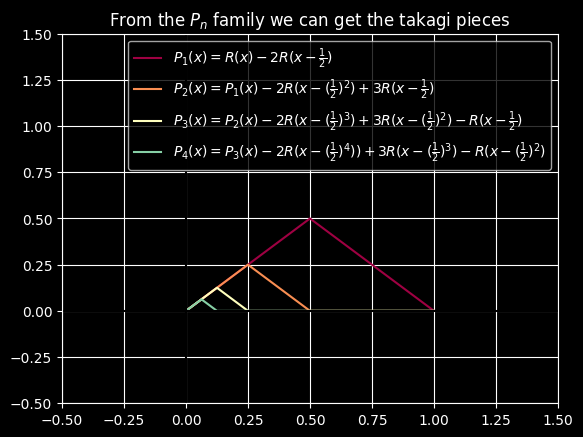
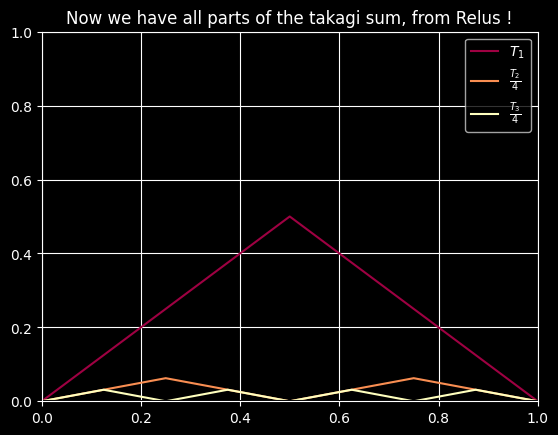
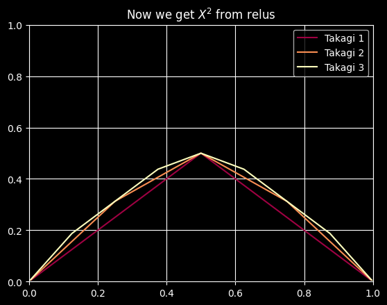

# Topics

## Obtain all polynomials from neural networks with Relus

Inspired by this [video](https://youtu.be/PApGm1TKFHQ)

I took a different approach and built visually one-by-one the triangle functions to show the intuition, but same idea.
Basically a visual demonstration of the universal approximation theorem 

[Also here is a cool paper](https://arxiv.org/abs/2012.03016) that shows that 3 layers is enough to approximate any function continuous or not 
